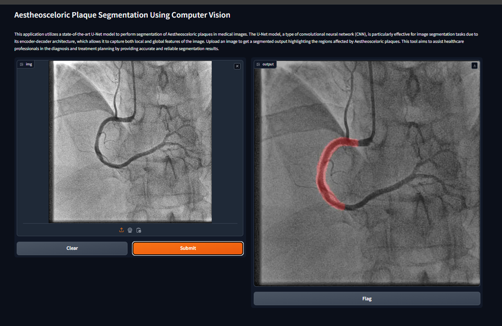

# Class :- CPME 255 - Section 1, Data Mining
* This project is a part of the data mining subject at San Jose State University, serving as a semester project aimed at applying theoretical knowledge to practical data analysis scenarios.

## Project Option 1 : Data Modelling
>We chose the data modelling option as our term project for this class. We developed a software application which can detect the aestheosceloric plaque using computer vision

# Aestheosceloric Plaque Segmentation Using Computer Vision

## Project Team
    1. Pratikkumar Dalsukhbhai Korat
        SJSU ID : 017512598
        Email ID: pratikkumardalsukhbhai.korat@sjsu.edu
    2. Alekhya Vaida
        SJSU ID : 017550039 
        Email ID: alekhya.vaida@sjsu.edu
    3.  Akhilandeswari Battineni
        SJSU ID : 016762174
        Email ID: akhilandeswari.battineni@sjsu.edu

## Project Stacks
    * PyTorch
    * GradIO (website application)
    * Matplotlib (data visualization)
    * OpenCV2 (data preprocessing)

## How to run project
    
    1. Download the repository

    2. Go inside the PlaqueSegment directory
        * run pip install -r requirements.txt
    
    3. Go inside deployment directory

    4. Run following command
        * python deploy.py

## User Interface

* This user interface provides a simple and effective way for medical practitioner to interact with this application

* More details on the project can be found in the report which is stored in this repository

* ARCADE directory contains the code of original paper's code
## Area of Contribution
    1. Pratikkumar Dalsukhbhai Korat
        > Training and Evaluation of Model, Literature review, Technical Documentation, Deployment

    2. Akhilandeswari Battineni
        > Documentation, Literature review, Report Writing.

    3. Alekhya Vaida
        > Documentation, Website Development, Literature review.
